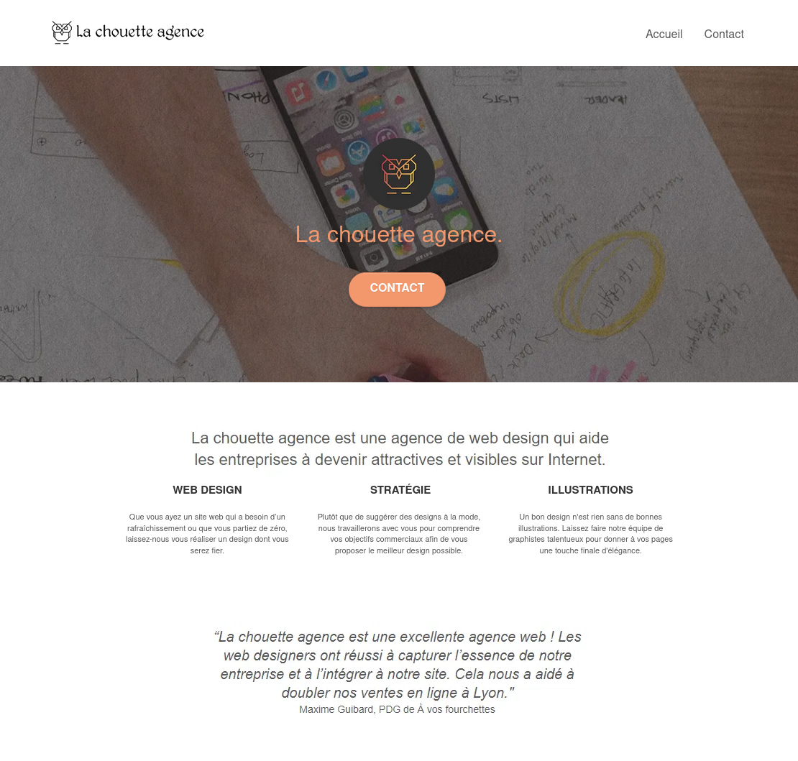

# La Chouette Agence - projet Openclassrooms
Quatrième projet du parcours ***développeur web*** chez **OpenClassrooms**, dont l'objectif est de réaliser l'analyse du site internet d'une agence de web design afin de présenter les axes d'améliorations et d'optimisation du référencement, des performances et de l'accessibilité.

## Éléments fournis par l'entreprise virtuelle.
- La [maquette du site](https://s3-eu-west-1.amazonaws.com/course.oc-static.com/projects/GEN_integrateur_web_P4/Starting+website.zip) dans son état actuel.
- Le [modèle](https://s3-eu-west-1.amazonaws.com/course.oc-static.com/projects/DW_P4/Mode%CC%80le-audit-SEO.xlsx) pour la réalisation du rapport d'analyse.

## Cahiers des charges
Réalisation et présentation des deux livrables:
- Rapport d'analyse SEO, identifiant les différentes recommandations d'optimisation du site.
- Rapport d'optimisation, comparant les résultats apportés par l'application de ces améliorations.

### Contraintes techniques
- Chaque recommandation doit indiquée la bonne pratique à appliquer, être argumentée, justifiée, et doit également être sourcée.
- Une sélection de dix propositions doit être effectuée parmi la liste de recommandations.
- Le but prioritaire est d'obtenir un meilleur positionnement en réponse aux requêtes “Entreprise webdesign Lyon” dans les moteurs de recherche.
- Les performances (vitesse et taille du site) et l'accessibilité devront également faire l'objet d'au moins une recommandation.
- Utiliser uniquement HTML et CSS pour les différentes modifications.
- Conserver le responsive design du site.
- N'obtenir aucune erreur ni alerte au validateur W3C [HTML](https://validator.w3.org/nu/?doc=https%3A%2F%2Fmickgalmiche.github.io%2FOC_La-Chouette-Agence%2F) et [CSS.](https://jigsaw.w3.org/css-validator/)
- Les livrables doivent être professionnels, et proposer une bonne qualité rédactionnelle de son contenu.